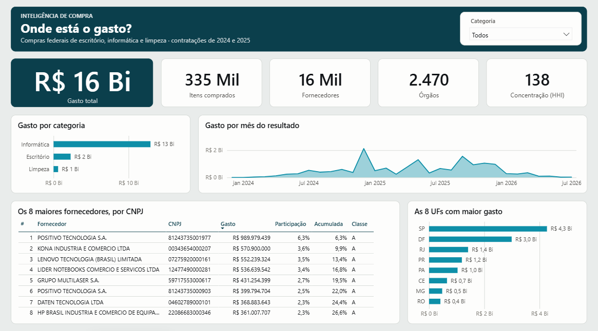
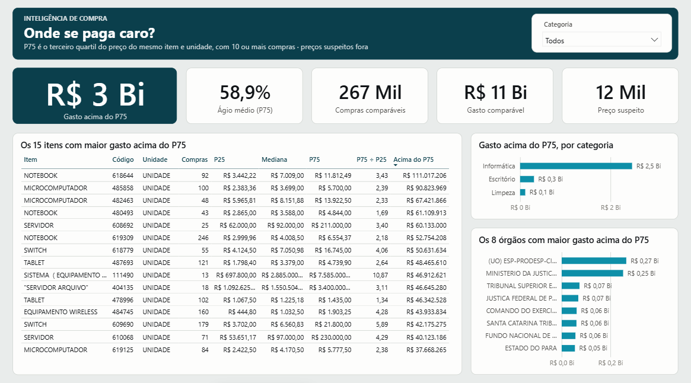
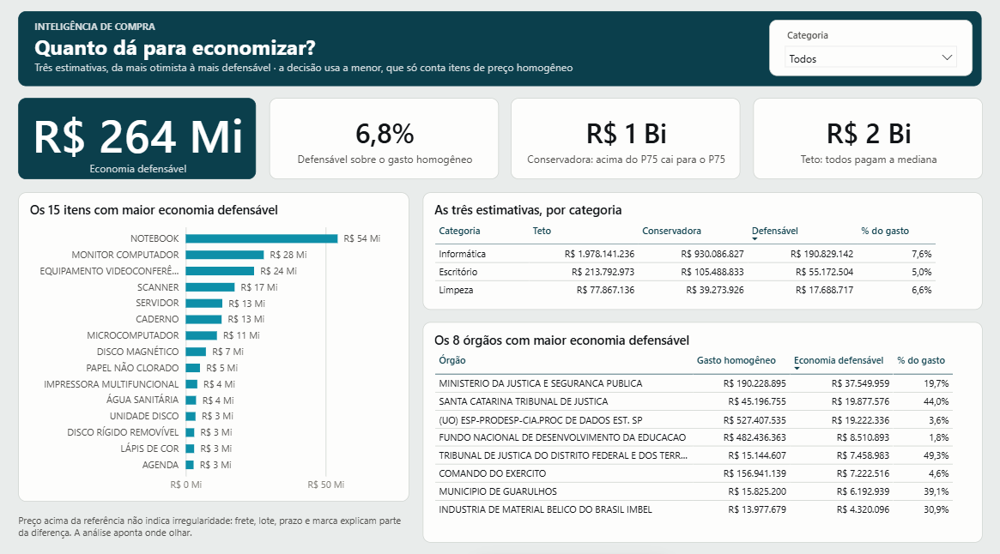
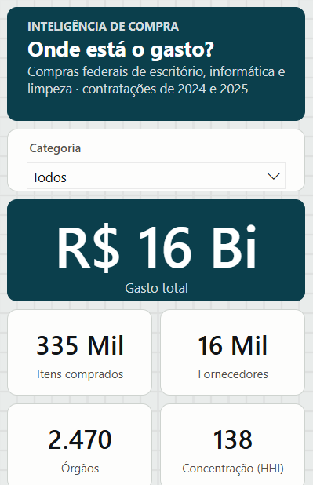
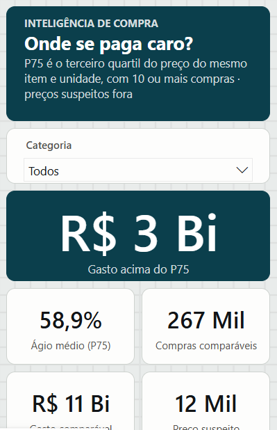
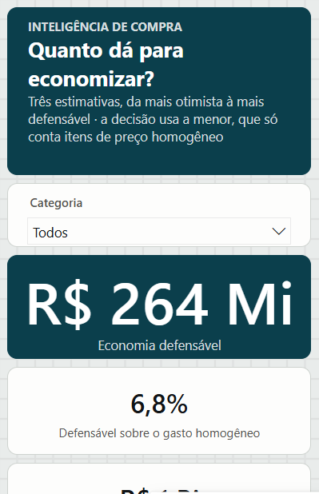
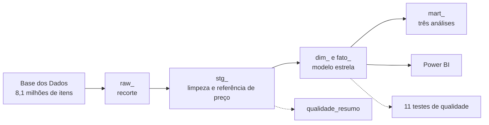

# Inteligência de Compra

Análise de gasto (*spend analytics*) em compras indiretas — material de escritório,
informática e limpeza — com BigQuery, SQL analítico, testes de qualidade de dados, modelo
estrela e Power BI.

> **Sobre os dados.** São compras públicas federais de 2024 e 2025, publicadas pela
> [Base dos Dados](https://basedosdados.org/dataset/bb11d3e6-6bac-412e-bbb8-773369771a70).
> Aqui elas fazem o papel do histórico de compras de um ERP corporativo: o método é o mesmo
> que uma área de Compras ou Controladoria aplicaria aos próprios dados. Os números não
> descrevem nenhuma empresa privada.

## O problema

Organizações grandes compram o mesmo item por preços muito diferentes, conforme a unidade,
o comprador e o fornecedor. Três perguntas orientam o projeto:

1. **Onde está o gasto?**
2. **Onde se paga caro?**
3. **Quanto dá para economizar, e por onde começar?**

## O que os dados mostram

Base analisada: **334.901 itens comprados**, **R$ 15,8 bilhões**, 2.470 órgãos e 16.012
fornecedores.

| | Informática | Escritório | Limpeza |
|---|---|---|---|
| Gasto (R$ milhões) | 12.923,0 | 2.274,2 | 608,2 |
| Itens comprados | 77.068 | 185.629 | 72.204 |
| Fornecedores | 6.913 | 8.131 | 6.060 |
| Fornecedores que somam 80% do gasto | 116 | 309 | 565 |
| Economia defensável (R$ milhões) | 190,8 | 55,2 | 17,7 |

- **O gasto está em informática (82%), o volume de trabalho em escritório (55% dos itens).**
- **O mercado é pulverizado.** Em informática, 116 fornecedores concentram 80% do gasto e
  outros 6.384 dividem os últimos 5%.
- **O mesmo produto tem preços bem diferentes.** Papel A4 75 g/m², 377 compras de 169
  órgãos: metade pagou até R$ 22,04 e um quarto pagou mais de R$ 26,16.
- **Economia defensável de R$ 263,7 milhões**, 6,8% do gasto nos itens de preço homogêneo.

### A decisão que isso sustenta

1. Adotar **preço de referência por item** nos itens de preço homogêneo: compra acima do
   terceiro quartil exige justificativa.
2. **Centralizar a compra** dos itens de alto volume, começando por monitores, notebooks e
   papel A4.
3. **Reduzir a cauda de fornecedores**: mais de 6 mil por categoria para 5% do gasto.

### O que os dados não permitem concluir

- Preço acima da referência **não indica irregularidade**: frete, lote, prazo e marca
  explicam parte da diferença. A análise aponta onde olhar.
- O código de catálogo não garante produto idêntico. Por isso há três estimativas de
  economia (R$ 2.269,8 mi, R$ 1.074,9 mi e R$ 263,7 mi), e a decisão usa a menor. O
  raciocínio está em [docs/analises.md](docs/analises.md).

## O painel

Três páginas, uma por pergunta. O painel é **gerado por código** e seus números são
conferidos automaticamente contra o BigQuery (23 de 23 valores conferem); o processo está em
[powerbi/README.md](powerbi/README.md) e as decisões de design em
[powerbi/DESIGN.md](powerbi/DESIGN.md).







Cada página tem também um layout para celular, gerado pelo mesmo código:

<p>
  
  
  
</p>

As cores vêm de um tema por área de negócio (compras, financeiro, vendas, pessoas,
operações), com contraste conferido por teste. As decisões estão em
[powerbi/DESIGN.md](powerbi/DESIGN.md).

## Como foi construído



| Etapa | O que mostra | Onde |
|---|---|---|
| Validação dos dados | cobertura dos campos antes de modelar; total de 2024 de R$ 6,1 trilhões na origem | [docs/fase-0-validacao.md](docs/fase-0-validacao.md) |
| ELT em SQL | 18 tabelas, um arquivo por tabela, recriáveis com um comando | [sql/](sql/) |
| SQL analítico | CTEs e window functions: percentis por grupo, ranking, participação acumulada | [sql/22_stg_item_valido.sql](sql/22_stg_item_valido.sql), [sql/50_mart_gasto_fornecedor.sql](sql/50_mart_gasto_fornecedor.sql) |
| Qualidade de dados | funil de exclusões com valores, 11 testes, validação de CNPJ em SQL, prova com erros plantados | [docs/qualidade.md](docs/qualidade.md) |
| Modelo estrela | fato de itens comprados e quatro dimensões | [docs/modelo.md](docs/modelo.md) |
| Análises | as três perguntas, com números e limites | [docs/analises.md](docs/analises.md) |
| Decisões | por que cada escolha foi feita e o que ela não resolve | [docs/decisoes.md](docs/decisoes.md) |
| Power BI como código | painel gerado por script (PBIP, TMDL), 30 medidas DAX, conferência automática contra o BigQuery | [powerbi/README.md](powerbi/README.md) |
| Controle de custo | estimativa e teto de bytes em toda consulta | [src/compras/executor.py](src/compras/executor.py) |

### Achados de qualidade de dados

- 30.238 linhas de **serviço** com código igual ao de materiais do catálogo, somando
  R$ 13,7 bilhões: sem o filtro, o gasto quase dobraria.
- 948 grafias de unidade de medida, padronizadas para 570.
- 11.702 compras com **preço suspeito** (mais de 10 vezes fora da mediana), como um
  microcomputador a R$ 144,9 milhões: o valor do lote no campo de preço unitário.
- Cabeçalhos de contratação repetidos duplicavam itens na fato; o teste de conferência de
  totais acusou 269 linhas a mais antes de qualquer análise.

## Como reproduzir

Pré-requisitos: Python 3.12, [Google Cloud CLI](https://cloud.google.com/sdk/docs/install)
e um projeto no Google Cloud (o modo gratuito do BigQuery basta; não exige cartão).

```bash
git clone https://github.com/diaquinodev/inteligencia-de-compra.git
cd inteligencia-de-compra
python -m venv .venv
.venv\Scripts\activate            # Linux/macOS: source .venv/bin/activate
pip install -e ".[dev]"

gcloud auth login
set COMPRAS_PROJETO=seu-projeto   # Linux/macOS: export COMPRAS_PROJETO=seu-projeto

python -m compras construir       # cria as 18 tabelas (cerca de 1 minuto)
python -m compras testar          # roda os 11 testes de qualidade
```

O painel tem seu próprio passo a passo (gerar, abrir, conferir e capturar) em
[powerbi/README.md](powerbi/README.md); essa parte exige Windows e Power BI Desktop.

Saída esperada do último comando: `11 de 11 regras passaram.`

Outras opções:

```bash
python -m compras construir --estimar       # só estima o custo, não executa
python -m compras construir --prefixo 5     # recria só as análises (mart_)
```

| Variável | Padrão | Para quê |
|---|---|---|
| `COMPRAS_PROJETO` | `inteligencia-de-compra` | projeto do Google Cloud |
| `COMPRAS_DATASET` | `compras` | conjunto de dados de destino |
| `COMPRAS_TETO_GIB` | `6` | máximo de dados que uma consulta pode ler |

Verificações do código: `ruff check .`, `mypy src`, `sqlfluff lint sql`, `pytest` (30 testes).

## Estrutura

```
sql/            um arquivo por tabela, em ordem de execução (raw, stg, dim, fato, mart)
sql/tests/      testes de qualidade: consultas que devem voltar vazias
src/compras/    executor, testes de qualidade, gerador do painel e linha de comando
tests/          testes do executor e do gerador do painel (sem acesso ao BigQuery)
docs/           validação, qualidade, modelo, análises e decisões
powerbi/        projeto do painel (PBIP), medidas DAX e scripts de abrir, conferir e capturar
```

## Próximos passos

- Ler a descrição livre dos itens para separar especificações dentro do mesmo código de
  catálogo, com gabarito e taxa de acerto medida.
- Converter embalagens para unidade base (preço por folha, por litro).
- Agendar o pipeline e migrar o SQL para dbt.

## Licença

MIT para o código. Os dados pertencem às suas fontes e seguem as licenças delas.
