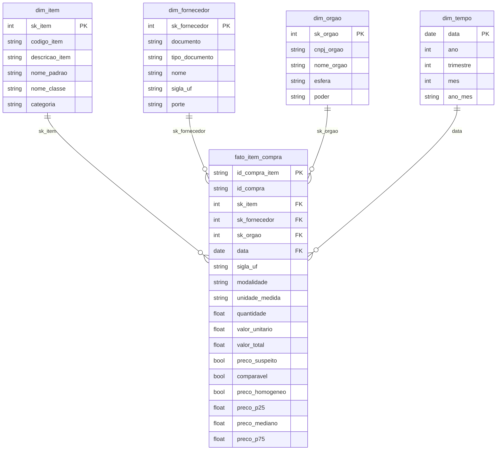

# Modelo de dados

## Camadas

| Prefixo | Camada | O que faz |
|---|---|---|
| `raw_` | bruta | recorte das tabelas públicas, sem transformação (3 grupos do catálogo, 2024–2025) |
| `stg_` | limpa | tipos, padronização, duplicatas, motivo de exclusão, referência de preço |
| `dim_` / `fato_` | modelo estrela | o que o Power BI lê |
| `mart_` | análises | respostas prontas para as três perguntas |

Cada arquivo de `sql/` cria uma tabela com `CREATE OR REPLACE TABLE`. Os arquivos rodam em
ordem de nome, e rodar de novo chega ao mesmo resultado.

## Modelo estrela

## Grão e tamanhos (03/10/2026)

- **Grão da fato:** um item de uma contratação homologada, com fornecedor e preço.
- `fato_item_compra`: 334.901 linhas, R$ 15,8 bilhões, 43.150 contratações.
- `dim_item`: 37.300 itens de catálogo (13.452 foram comprados no período).
- `dim_fornecedor`: 16.012 fornecedores. `dim_orgao`: 2.470 órgãos. `dim_tempo`: 940 dias.

## Decisões

- **UF e modalidade ficam na fato.** São atributos da contratação, não do órgão: o mesmo
  órgão compra em várias UFs e modalidades. 3.954 itens não têm cabeçalho na origem e ficam
  com "Não informado", em vez de serem descartados.
- **A referência de preço fica na fato.** `preco_p25`, `preco_mediano` e `preco_p75` são do
  grupo de comparação (item + unidade de medida) e se repetem nas linhas do grupo. Assim o
  Power BI calcula a economia linha a linha, sem refazer percentis.
- **Chaves substitutas** (`sk_`) são números sequenciais ordenados pela chave de negócio, o
  que as mantém estáveis entre execuções com os mesmos dados.
