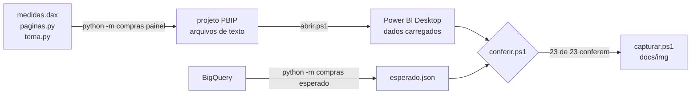

# Painel como código

O painel do Power BI deste projeto não é montado à mão. Ele é **gerado por um script** a
partir de três fontes em texto, e conferido automaticamente contra o BigQuery.

| Fonte | O que define |
|---|---|
| [medidas.dax](medidas.dax) | as 30 medidas DAX e as consultas de conferência |
| [src/compras/painel/paginas.py](../src/compras/painel/paginas.py) | as 3 páginas: quais visuais, com quais campos, em que posição |
| [src/compras/painel/tema.py](../src/compras/painel/tema.py) | cores, fontes e o estilo comum dos visuais |

O modelo (tabelas, colunas e relacionamentos) fica em
[inteligencia-de-compra.SemanticModel/definition](inteligencia-de-compra.SemanticModel/definition),
em TMDL, o formato de texto do Power BI.

## Por que assim

- **Revisão:** um `.pbix` é um arquivo binário; uma mudança de medida ou de gráfico não
  aparece em diff. Aqui cada visual é um arquivo JSON e cada medida é texto.
- **Reprodução:** um comando recria o painel inteiro. Não há passo manual para esquecer.
- **Teste:** os números do painel são comparados com o BigQuery por programa, não a olho.

## Fluxo



## Passo a passo

Pré-requisitos: Windows, Power BI Desktop, as tabelas criadas no BigQuery
(`python -m compras construir`) e o login já feito uma vez no conector do BigQuery dentro do
Power BI Desktop (Obter dados → Google BigQuery).

```powershell
# 1. Gera o projeto do Power BI a partir das fontes em texto
python -m compras painel

# 2. Calcula no BigQuery os valores que o painel deve mostrar
python -m compras esperado

# 3. Abre o projeto no Power BI Desktop e carrega os dados (cerca de 2 minutos)
powershell -ExecutionPolicy Bypass -File powerbi\scripts\abrir.ps1

# 4. Compara as medidas do painel com os valores do BigQuery
powershell -ExecutionPolicy Bypass -File powerbi\scripts\conferir.ps1

# 5. Captura uma imagem de cada página em docs\img\
powershell -ExecutionPolicy Bypass -File powerbi\scripts\capturar.ps1
```

Saída esperada do passo 4:

```
ok      Gasto Total                                     15.805.333.119,6600
ok      Itens Comprados                                        334.901,0000
...
23 de 23 valores conferem com o BigQuery.
```

O passo 4 sai com código 1 se qualquer valor divergir.

## O que é verificado, e como

| Verificação | Onde | Roda no CI |
|---|---|---|
| Toda medida tem formato; nomes não se repetem | `tests/test_painel.py` | sim |
| Cada arquivo gerado segue o esquema JSON publicado pela Microsoft | `tests/test_painel.py` + `tests/schemas/` | sim |
| Todo campo usado num visual existe no modelo | `tests/test_painel.py` | sim |
| Visuais cabem na página e não se sobrepõem | `tests/test_painel.py` | sim |
| Gerar duas vezes dá o mesmo resultado; visual antigo é removido | `tests/test_painel.py` | sim |
| O modelo TMDL carrega na biblioteca da Microsoft | ao abrir no Power BI Desktop | não |
| As medidas DAX dão os mesmos números que o SQL no BigQuery | `scripts/conferir.ps1` | não |
| As páginas renderizam sem erro | `scripts/capturar.ps1` + olhar as imagens | não |

As três últimas precisam do Power BI Desktop aberto, que só existe no Windows; por isso
ficam fora do CI e rodam na máquina de quem altera o painel.

A conferência de números é independente de propósito: `esperado.py` calcula cada grandeza em
SQL direto da tabela fato, sem usar as medidas DAX nem as tabelas `mart_`. Quando o Power BI
e o BigQuery chegam ao mesmo valor por caminhos diferentes, a medida está certa.

## Como os scripts conversam com o Power BI

O Power BI Desktop abre, para cada arquivo, um motor local do Analysis Services. Os scripts
se conectam a esse motor com as bibliotecas cliente da Microsoft (baixadas do NuGet na
primeira execução, em `scripts/.bibliotecas/`):

- `abrir.ps1` espera a página aparecer na tela e pede a carga completa dos dados;
- `conferir.ps1` executa as consultas de conferência de `medidas.dax`;
- `capturar.ps1` troca de página pela automação de interface do Windows e captura só a
  janela do Power BI, recortando a área da página.

## Como alterar o painel

| Para mudar | Edite | Depois |
|---|---|---|
| uma medida | `medidas.dax` (e `FORMATOS` em `medidas.py`, se for nova) | passos 1 a 4 |
| um visual, um título, uma posição | `paginas.py` | passos 1, 3 e 5 |
| cores e fontes | `tema.py` | passos 1, 3 e 5 |
| uma coluna do modelo | o SQL em `sql/` e o TMDL da tabela | `construir`, depois passos 1 a 5 |

Não salve o projeto pelo Power BI Desktop: ele regrava os arquivos no formato dele e a
próxima geração desfaz a alteração. O Power BI serve aqui para ver e explorar; a fonte é o
código.

## Limites

- **Só Windows.** Os scripts de abrir, conferir e capturar dependem do Power BI Desktop.
- **Dados não ficam no repositório.** Quem clona precisa das tabelas no próprio BigQuery e
  carrega os dados com `abrir.ps1`.
- **Carregar dados cedo demais trava o Power BI.** Pedir a carga enquanto o arquivo ainda
  abre deixa os dois esperando um pelo outro; por isso `abrir.ps1` espera a página aparecer.
- **O formato PBIR muda entre versões.** Os esquemas usados estão fixados em versões de 2025
  e copiados em `tests/schemas/`. Testado no Power BI Desktop 2.158 (setembro de 2026).
- **Tipos de visual cobertos:** cartão, barras, colunas, tabela, segmentação e caixa de texto.
